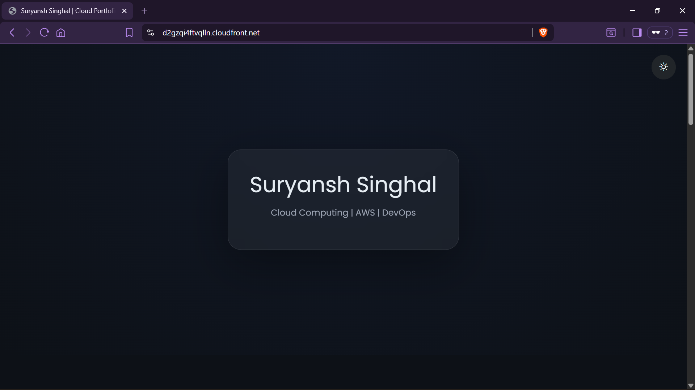

# 🌐 Static Portfolio Website on AWS (S3 + CloudFront)

## 📌 Overview

This project demonstrates the deployment of a **highly available and scalable static website** using AWS cloud services.
The website is hosted on **Amazon S3** and delivered globally via **Amazon CloudFront (CDN)** with secure access using **Origin Access Control (OAC)**.

---

## 🚀 Live Demo

👉 https://d2gzqi4ftvqlln.cloudfront.net

---

## 🏗️ Architecture

* **Amazon S3** → Stores static website files (HTML, CSS)
* **Amazon CloudFront** → Provides global CDN delivery
* **OAC (Origin Access Control)** → Secures S3 bucket access
* **HTTPS** → Enabled for secure communication

---

## 🛠️ Tech Stack

* HTML5, CSS3
* AWS S3 (Static Hosting)
* AWS CloudFront (CDN)
* AWS IAM (Access Control & Policies)

---

## 📂 Project Structure

```id="struct1"
portfolio-cloud-site/
│
├── website/
│   ├── index.html
│   └── style.css
│
├── screenshots/
│   ├── 01-s3-static-hosting.png
│   ├── 02-cloudfront-distribution.png
│   ├── 03-live-website.png
│   └── 04-s3-objects.png
│
└── README.md
```

---

## ⚙️ Key Features

* Static website hosting using AWS S3
* Global content delivery via CloudFront CDN
* Secure origin access using OAC
* HTTPS enabled (SSL/TLS encryption)
* Optimized caching for faster performance
* Clean and responsive UI

---

## 📸 Screenshots

### S3 Static Website Hosting


### CloudFront Distribution


### Live Website



### S3 Objects


---

## 🔧 Deployment Steps

### 1️⃣ S3 Bucket Setup

* Created an S3 bucket
* Disabled Block Public Access
* Uploaded static files (`index.html`, `style.css`)

### 2️⃣ Static Website Hosting

* Enabled static hosting
* Configured index document → `index.html`

### 3️⃣ CloudFront Configuration

* Created distribution with S3 as origin
* Enabled **Origin Access Control (OAC)**
* Configured Viewer Protocol Policy → Redirect HTTP to HTTPS
* Set default root object → `index.html`

### 4️⃣ Deployment

* Waited for distribution deployment
* Accessed website via CloudFront domain

---

## 📚 Key Learnings

* Deploying static websites on AWS S3
* Configuring CloudFront for CDN-based delivery
* Implementing secure access using OAC
* Understanding caching and performance optimization
* Debugging real-world cloud deployment issues

---

## 🚀 Future Improvements

* Add custom domain using Route 53
* Implement CI/CD using GitHub Actions
* Enhance UI with modern frameworks (React/Tailwind)
* Add backend services (Flask API on EC2)

---

## 👨‍💻 Author

**Suryansh Singhal**
MCA Student | Cloud Computing Enthusiast

📧 [suryanshsinghal.work@gmail.com](mailto:suryanshsinghal.work@gmail.com)
